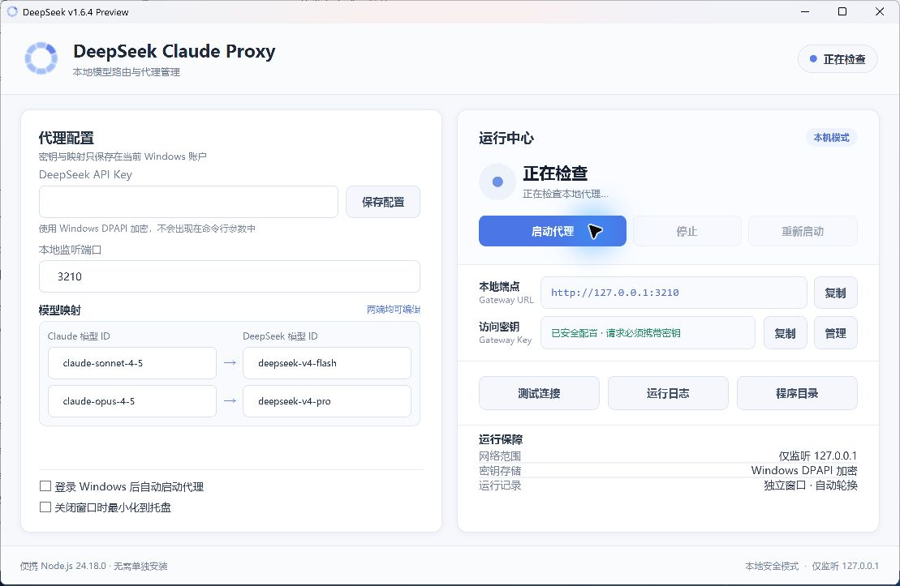

# Claude DeepSeek model proxy

Local Anthropic-compatible proxy for Claude Desktop 3P mode. It keeps Claude-facing model IDs while sending real DeepSeek model IDs upstream.

| Claude-facing model ID | DeepSeek-facing model ID |
| --- | --- |
| `claude-opus-4-5` | `deepseek-v4-pro` (default) |
| `claude-sonnet-4-5` | `deepseek-v4-flash` (default) |

## Windows GUI

The graphical manager provides fully editable model mappings on both sides, encrypted DeepSeek and Gateway key storage, one-click start/stop/restart, health checks, a clearly displayed local endpoint with one-click copy, a separate log window, system-tray operation, and optional Windows login startup. Claude-facing and DeepSeek-facing model IDs are saved for the current Windows account and applied on the next proxy start.



Download the current portable Windows x64 package from [GitHub Releases](https://github.com/gd164954/claude-deepseek-proxy/releases/latest). Extract the ZIP to a normal writable folder and keep all files together. The portable package already contains Node.js.

Build it without installing a .NET SDK or NuGet packages:

```powershell
Set-ExecutionPolicy -Scope Process -ExecutionPolicy Bypass
.\build-gui.ps1
```

The default build bundles `node.exe`. To use the result on another 64-bit Windows 10/11 PC, copy the entire `dist\DeepSeekProxyManager` folder; Node.js does not need to be installed on the target PC. If you deliberately build with `-SkipBundledNode`, the target PC needs Node.js 20 or newer.

On this enterprise-managed PC, Windows Application Control requires enterprise-signed executables. Use the compatible Microsoft-signed PowerShell host entry:

```text
dist\DeepSeekProxyManager\Launch-DeepSeekProxyManager.cmd
```

Double-click the launcher, enter the DeepSeek API Key, select **保存**, and select **启动**. The manager generates a separate stable Gateway API key on first launch; use **管理** beside the Gateway key status to change, copy, or regenerate it. Every local request must provide this key. Both keys are encrypted with Windows DPAPI for the current Windows account and are never placed on a process command line.

The adjacent `DeepSeekProxyManager.exe` is available for unmanaged Windows PCs that allow locally compiled applications. Both launchers use the same interface and proxy core.

## Recommended Local Setup

Run one local proxy window:

```powershell
git clone https://github.com/gd164954/claude-deepseek-proxy.git
cd claude-deepseek-proxy

Set-ExecutionPolicy -Scope Process -ExecutionPolicy Bypass
.\start-proxy.ps1
```

For command-line use, override either target model when needed:

```powershell
.\start-proxy.ps1 `
  -SonnetAliasModel "claude-sonnet-custom" `
  -SonnetTargetModel "deepseek-chat" `
  -OpusAliasModel "claude-opus-custom" `
  -OpusTargetModel "deepseek-reasoner"
```

The script securely prompts for both the DeepSeek API key and the separate Gateway API key when their environment variables are not already set. Avoid putting real keys directly in a command because PowerShell command history stores them.

Expected startup line:

```text
INFO listening http://127.0.0.1:3210
```

Every request, including requests from `127.0.0.1`, must provide the Gateway API key as a Bearer token or `x-api-key` header.

Browser CORS is disabled by default. If a trusted browser application really needs access, allow its exact origin:

```powershell
.\start-proxy.ps1 -CorsOrigin "http://127.0.0.1:8080"
```

## Claude Desktop Profile

If Claude recreates an empty `Default` 3P profile, open Developer / 3P once, then patch the current applied profile:

```powershell
$env:PROXY_API_KEY = Read-Host "Dedicated local proxy key"
.\install-claude-desktop-local-profile.ps1 -PatchAppliedProfile
```

The profile should point to:

```text
Gateway base URL: http://127.0.0.1:3210
Gateway auth scheme: bearer
Models: claude-opus-4-5, claude-sonnet-4-5
```

The profile stores its local gateway key in Claude's configuration. Use a dedicated random value, never the DeepSeek API key.

If Claude keeps recreating the `Default` profile, run the watcher while opening Developer / 3P:

```powershell
.\watch-claude-local-profile.ps1
```

## Checks

Authenticated local model check:

```powershell
$gatewayKey = Read-Host "Gateway API key"
$gatewayHeaders = @{ Authorization = "Bearer $gatewayKey" }
Invoke-RestMethod http://127.0.0.1:3210/v1/models -Headers $gatewayHeaders |
  ConvertTo-Json -Depth 5
```

Token count endpoint used by Claude Desktop Code:

```powershell
$body = @{
  model = "claude-sonnet-4-5"
  messages = @(@{ role = "user"; content = "hello" })
} | ConvertTo-Json -Depth 5

Invoke-RestMethod `
  -Method Post `
  -Uri http://127.0.0.1:3210/v1/messages/count_tokens `
  -Headers $gatewayHeaders `
  -ContentType "application/json" `
  -Body $body |
  ConvertTo-Json -Depth 5
```

Successful runtime logs look like:

```text
startup {"version":"1.6.10","pid":1234,"node":"v22.x.x","host":"127.0.0.1","port":3210}
model_rewrite {"request_id":"...","rewrite":"claude-sonnet-4-5 -> deepseek-v4-flash"}
upstream_response {"request_id":"...","status":200,"path":"/v1/messages","ttfb_ms":184}
request_complete {"request_id":"...","status":200,"path":"/v1/messages","ttfb_ms":184,"duration_ms":1260}
shutdown_requested {"version":"1.6.10","pid":1234,"reason":"manager_exit","uptime_ms":3600000}
shutdown_complete {"version":"1.6.10","pid":1234,"reason":"manager_exit","uptime_ms":3600012,"exit_code":0}
```

`ttfb_ms` measures the time until upstream response headers arrive; `duration_ms` on `request_complete` measures the full request, including streamed output. Client cancellations are recorded separately as `client_disconnected` instead of being reported as proxy failures. Startup and shutdown entries include the proxy version, PID, uptime, and the manager-provided stop or restart reason.

By default, the high-frequency local token-count requests are not written to the log. To debug them temporarily, add:

```powershell
-LogCountTokens
```

`proxy.log` is rotated automatically at 1 MB and keeps 3 backups: `proxy.log.1`, `proxy.log.2`, `proxy.log.3`. You can change this when starting:

```powershell
.\start-proxy.ps1 `
  -LogMaxBytes 2097152 `
  -LogBackups 5
```

Requests are limited to 25 MB and upstream calls time out after 120 seconds. Both are configurable:

```powershell
.\start-proxy.ps1 `
  -MaxBodyBytes 26214400 `
  -UpstreamTimeoutMs 120000
```

## Tests

Requires Node.js 20 or newer:

```powershell
npm test
```

## Notes

- Never commit real DeepSeek or Gateway API keys. If a key has been exposed, revoke it and create a replacement before publishing logs or configuration files.
- Keep the proxy PowerShell window open while Claude Desktop is using it.
- Removed Cloudflare and local HTTPS experiment files are backed up in `backups\pre-remove-cloudflared-*.zip` and `backups\pre-remove-https-experiment-*.zip`.
- Experimental response transforms exist for debugging only: `TRANSFORM_RESPONSES=true`, `FORCE_UPSTREAM_NON_STREAM=true`.
